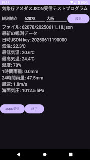
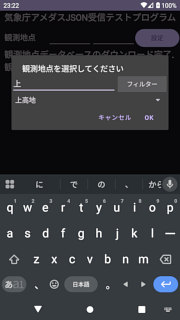

## Android 気象庁アメダスJSON受信テストプログラム<br/>JMA AMEDAS JSON receiver test program<!-- omit in toc -->

[Home](https://oasis3855.github.io/webpage/) > [Software](https://oasis3855.github.io/webpage/software/index.html) > [Software Download](https://oasis3855.github.io/webpage/software/software-download.html) > [android-tools](../README.md) > ***AmedasJsonTest01*** (this page)

<br />
<br />

Last Updated : June 2025

- [ソフトウエアのダウンロード](#ソフトウエアのダウンロード)
- [概要](#概要)
- [実装されている機能](#実装されている機能)
- [実際のJSONファイル例](#実際のjsonファイル例)
  - [観測地点名データベース](#観測地点名データベース)
  - [AMEDASデータベース](#amedasデータベース)
- [動作確認済み](#動作確認済み)
- [バージョンアップ情報](#バージョンアップ情報)
- [ライセンス](#ライセンス)

<br />
<br />

## ソフトウエアのダウンロード

-  [このGitHubリポジトリを参照する（ソースコード）](./app/src/)
-  [このGitHubリポジトリを参照する（apkファイル）](./app/release/)

<br />
<br />

## 概要

気象庁のアメダスJSONデータを読み込んで画面表示するテストプログラム。

|  |  |
|--|--|
|  |  |
| メイン画面 | 観測地点選択AlertDialog |


<br />
<br />

## 実装されている機能

- 任意の観測地点の10分ごとに更新される最新データを読み込んで表示
- 観測地点を選択するAlertDialog
- 観測地点名を選択するSpinnerを、部分一致で項目数をフィルタリング

## 実際のJSONファイル例

### 観測地点名データベース

URL : https://www.jma.go.jp/bosai/amedas/const/amedastable.json

2025年6月現在、1286地点がJSONデータベースに格納されている。観測地点Noがキーとなっている。

```JSON
{
  "11001": {
    "type": "C",
    "elems": "11112010",
    "lat": [
      45,
      31.2
    ],
    "lon": [
      141,
      56.1
    ],
    "alt": 26,
    "kjName": "宗谷岬",
    "knName": "ソウヤミサキ",
    "enName": "Cape Soya"
  },
  "11016": {
    "type": "A",
    "elems": "11111111",
    "lat": [
      45,
      24.9
    ],
    "lon": [
      141,
      40.7
    ],
    "alt": 3,
    "kjName": "稚内",
    "knName": "ワッカナイ",
    "enName": "Wakkanai"
  },
  〜 以下省略 〜
```

### AMEDASデータベース

観測地点Noと、年月日_時刻を含んだURLからダウンロードする。なお、時刻は3時間毎で 00, 03, 06, ... 21 の値を取る。

URL : https://www.jma.go.jp/bosai/amedas/data/point/[観測地点No]/[yyyymmdd_hh].json

JSONデータベースは、年月日時分秒がプライマリーキーとして構成されている。なお、データは10分ごとであるため、キーの下2桁（sec相当）は常にゼロである。

次に示すJSONデータベースは https://www.jma.go.jp/bosai/amedas/data/point/44132/20250612_18.json をダウンロードしたものである。

```JSON
{
  "20250612120000": {
    "prefNumber": 44,
    "observationNumber": 132,
    "pressure": [
      1011.1,
      0
    ],
    "normalPressure": [
      1013.9,
      0
    ],
    "temp": [
      25.6,
      0
    ],
    "humidity": [
      56,
      0
    ],
    "snow": [
      null,
      5
    ],
    "snow1h": [
      0,
      6
    ],
    "snow6h": [
      0,
      6
    ],
    "snow12h": [
      0,
      6
    ],
    "snow24h": [
      0,
      6
    ],
    "sun10m": [
      0,
      0
    ],
    "sun1h": [
      0.1,
      0
    ],
    "precipitation10m": [
      0.0,
      0
    ],
    "precipitation1h": [
      0.0,
      0
    ],
    "precipitation3h": [
      0.0,
      0
    ],
    "precipitation24h": [
      6.5,
      0
    ],
    "windDirection": [
      1,
      0
    ],
    "wind": [
      1.6,
      0
    ],
    "maxTempTime": {
      "hour": 1,
      "minute": 49
    },
    "maxTemp": [
      26.9,
      0
    ],
    "minTempTime": {
      "hour": 19,
      "minute": 54
    },
    "minTemp": [
      19.1,
      0
    ],
    "gustTime": {
      "hour": 21,
      "minute": 54
    },
    "gustDirection": [
      13,
      0
    ],
    "gust": [
      6.1,
      0
    ]
  },
  "20250612121000": {
    "prefNumber": 44,
    "observationNumber": 132,
    "pressure": [
      1010.9,
      0
    ],
    "normalPressure": [
      1013.7,
      0
    ],
    "temp": [
      25.8,
      0
    ],
〜 以下省略 〜
```

<br />
<br />

## 動作確認済み

- Android 13 

<br />
<br />

## バージョンアップ情報

- Version 1.0 (2025/06/12)

  - 当初 

<br />
<br />

## ライセンス

このプログラムは [GNU General Public License v3ライセンスで公開する](https://gpl.mhatta.org/gpl.ja.html) フリーソフトウエア
