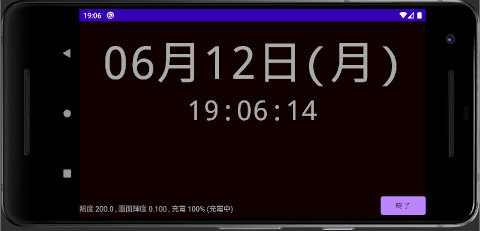

## Android シンプル デスク クロック Simple Desk Clock<!-- omit in toc -->

[Home](https://oasis3855.github.io/webpage/) > [Software](https://oasis3855.github.io/webpage/software/index.html) > [Software Download](https://oasis3855.github.io/webpage/software/software-download.html) > [android-tools](../README.md) > ***SimpleDeskClock*** (this page)

 
 

Last Updated : June 2023

- [ソフトウエアのダウンロード](#ソフトウエアのダウンロード)
- [概要](#概要)
- [実装されている機能](#実装されている機能)
- [動作確認済み](#動作確認済み)
- [バージョンアップ情報](#バージョンアップ情報)
- [ライセンス](#ライセンス)

 
 

## ソフトウエアのダウンロード

-  [このGitHubリポジトリを参照する（ソースコード）](./src/)
-  [このGitHubリポジトリを参照する（apkファイル）](./apk/)

 
 

## 概要

古いAndroidスマホを、置き時計として使うためのアプリケーション。机の上において、日めくりカレンダー代わりに使う目的で作成。

インストールする実機に合わせてフォントサイズ、照度センサーのしきい値を変更しapkファイルを再作成する必要があります。

Handleを使い1秒毎に画面更新するアクティビティ、画面タップの検出、センサー読み出しのサンプルコードとして公開。

 
 

## 実装されている機能

- 画面の自動回転に対応
- ACアダプタで充電中にのみバックライト点灯
- バックライト消灯時に、画面タップすると一時的にバックライト点灯
- 照度センサーがしきい値以下の場合はバックライト消灯

 
 

## 動作確認済み

- Android 4.1
- Android 10 

 
 

## バージョンアップ情報

- Version 1.0 (2023/06/12)

  - 当初 

 
 

## ライセンス

このプログラムは [GNU General Public License v3ライセンスで公開する](https://gpl.mhatta.org/gpl.ja.html) フリーソフトウエア
