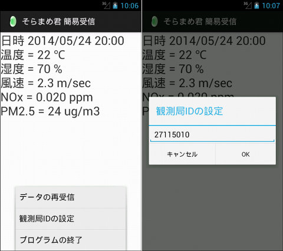

## Android 大気汚染物質広域監視システム「そらまめ君」の簡易受信アプリ MOE Japan AEROS json data receiver<!-- omit in toc -->

[Home](https://oasis3855.github.io/webpage/) > [Software](https://oasis3855.github.io/webpage/software/index.html) > [Software Download](https://oasis3855.github.io/webpage/software/software-download.html) > [android-tools](../README.md) > ***Webtool_SoramameReceive*** (this page)

 
 

Last Updated : May. 2014 (現在では使えません **Discontinued Software**)

- [ソフトウエアのダウンロード](#ソフトウエアのダウンロード)
- [概要](#概要)
  - [動作確認済み](#動作確認済み)
- [バージョンアップ情報](#バージョンアップ情報)
- [ライセンス](#ライセンス)

 
 

## ソフトウエアのダウンロード

-  [このGitHubリポジトリを参照する（主なソースコード）](./src/)
-  [このGitHubリポジトリを参照する（すべてのファイル）](./download/)
-  [Googleドライブを参照する（すべてのファイル）](https://drive.google.com/drive/u/0/folders/0B7BSijZJ2TAHNHJCbEJ4MUdBOFk?resourcekey=0--i5x1woXaerKN_TNRDPbuQ)

 
 

## 概要

環境省の大気汚染物質広域監視システム「そらまめ君」がAPIとして公開しているjsonデータを読み込んで画面に表示するアプリ。 

 

2023年現在、環境省のシステムのAPIが変更されているため、**このプログラムは利用できない**が、「AsyncTaskクラスを利用した**非同期処理**」や「org.json.JSONObjectクラスを用いた**JSONデータへのアクセス**」の参考資料となるため、残存させている。

 
 

### 動作確認済み

- Android 2.3.3
- Android 4.1 

 
 

## バージョンアップ情報

- Version 1.0 (2014/05/24)
    - 当初 

 
 

## ライセンス

このプログラムは [GNU General Public License v3ライセンスで公開する](https://gpl.mhatta.org/gpl.ja.html) フリーソフトウエア
